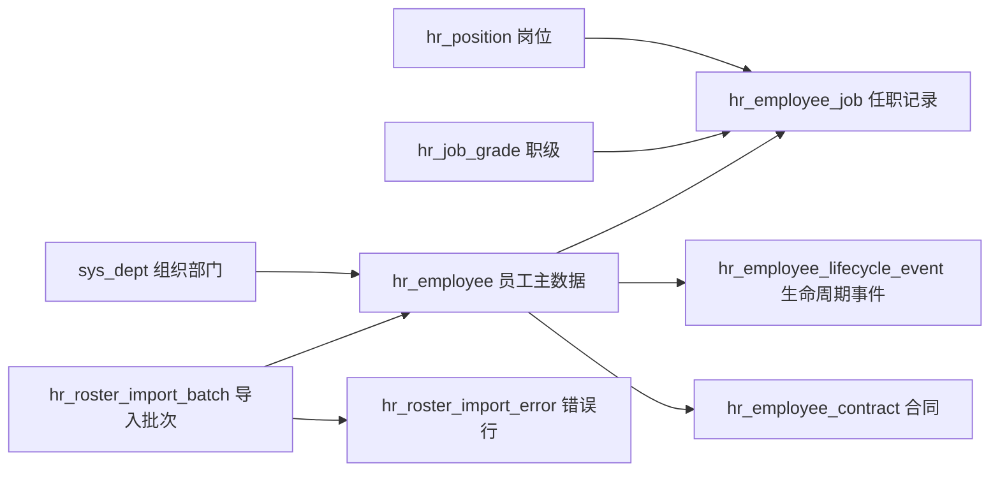

# HRMS 一期企业级设计方案

更新时间：2026-07-07
目标版本：v0.0.50 起
状态：Phase 1A 已在 v0.0.51 开始落地，Phase 1B 员工生命周期动作已在 v0.0.52 开始落地，Phase 1C 生命周期时间线已在 v0.0.54 落地，Phase 1D 合同核心接口已在 v0.0.55 开始落地，v0.0.56 已补齐合同终止和到期查询，v0.0.58 已开始落地花名册导入，v0.0.65 已补齐员工基础信息编辑闭环，v0.0.67 已补齐花名册导入前端闭环，v0.0.69 已补齐员工花名册导出闭环，v0.0.70 已补齐 HRMS 人力概览，v0.0.73 已预置 HRMS 基础数据字典，v0.0.75 已继续推进员工、合同、花名册和概览字典驱动枚举治理，v0.0.76 已落地 HRMS 员工主数据读接口数据范围强约束，v0.0.77 已落地 HRMS 员工列表与导出敏感字段脱敏，v0.0.78 已落地 HRMS 员工敏感字段查看权限闭环，v0.0.79 已落地花名册导入错误行脱敏治理，v0.0.80 已落地系统文件元数据和合同附件引用校验，v0.0.81 已落地文件状态和软删除保护，v0.0.82 已补齐系统文件资产管理页，v0.0.83 已补齐合同附件前端上传/查看/移除闭环，v0.0.84 已补齐合同附件下载业务授权，v0.0.85 已补齐合同附件上传人临时文件访问边界，v0.0.86 已补齐文件物理清理保留策略，v0.0.87 已补齐员工档案抽屉，v0.0.88 已补齐员工任职记录分栏，v0.0.89 已补齐员工组织关系分栏，v0.0.90 已补齐员工资料附件分栏，v0.0.91 已补齐员工资料类型与有效期治理，v0.0.92 已补齐员工资料到期预警，v0.0.93 已补齐员工资料预警前端运营页，v0.0.94 已统一 HRMS 附件前端受控下载链路，v0.0.95 已补齐敏感文件下载审计，v0.0.96 已补齐操作日志模块/操作/权限码筛选，v0.0.97 已补齐异常操作审计视角，v0.0.98 已补齐资料预警 CSV 导出，v0.0.99 已补齐合同预警 CSV 导出，v0.0.100 已补齐合同预警窗口筛选和字段对齐，v0.0.101 已补齐合同预警运营指标和风险状态，v0.0.102 已抽取 HRMS 预警前端共用工具，v0.0.103 已治理人力概览页国际化文案，v0.0.104 已治理合同管理页国际化文案，v0.0.105 已治理花名册导入页国际化文案，v0.0.106 已治理岗位/职级状态切换国际化文案，v0.0.107 已治理员工档案抽屉国际化文案，v0.0.108 已治理员工列表与生命周期操作国际化文案，v0.0.109 已治理 HRMS 字典兜底枚举国际化文案，v0.0.110 已治理 HRMS 前端 API 和表单类型契约，v0.0.111 已治理 HRMS 前端加载失败提示，v0.0.112 已抽取 HRMS 前端错误归一化共享工具，v0.0.113 已抽取 HRMS 前端文件展示与下载共享工具，v0.0.114 已统一 HRMS CSV 导出下载入口，v0.0.115 已治理 HRMS 上传与附件预览错误提示入口，v0.0.116 已统一 HRMS 受控附件打开入口，v0.0.117 已统一 HRMS 受控附件打开提示模式，v0.0.118 已统一 HRMS 受控附件打开 loading 反馈，v0.0.119 已补齐员工资料附件删除失败反馈，v0.0.120 已治理岗位/职级启停失败反馈，v0.0.121 已抽取 HRMS 状态切换确认共享工具，v0.0.122 已抽取 HRMS Blob 下载反馈共享工具，v0.0.123 已抽取 HRMS 上传反馈共享工具，v0.0.124 已抽取 HRMS 状态切换执行反馈共享工具，v0.0.125 已统一 HRMS Upload 文件解析与前置失败反馈，v0.0.126 已补齐 HRMS Upload 共享工具单元测试并恢复前端单测门禁，v0.0.127 已补齐 Playground 包级单测脚本，v0.0.128 已将包级单测升级为目录入口，v0.0.129 已新增 Jenkins 验证门禁基线，v0.0.130 已新增 CI 版本一致性门禁，v0.0.131 已统一本地与 Jenkins 验证入口，v0.0.132 已新增 CI 构建元数据归档，v0.0.133 已新增 CI 验证摘要归档，v0.0.134 已新增 CI 接口治理报告归档，v0.0.135 已新增 CI 数据库迁移审计报告归档，v0.0.136 已新增 CI 发布证据包归档，v0.0.137 已新增 CI 环境配置审计报告归档，v0.0.138 已治理 HRMS 员工管理页前端布局、受控部门范围选择、空状态主操作和登录页品牌图标预加载，v0.0.139 已治理 HRMS 合同管理页和系统用户页左右分栏列表体验、稳定表格高度、受控范围选择和引导式空状态，v0.0.140 已沉淀后台左右分栏列表共享布局组件并迁移员工、合同和系统用户页，v0.0.141 已新增前端布局治理报告和 Jenkins 门禁，v0.0.142 已治理后台列表工作区范围提示和主操作引导，v0.0.143 已沉淀 HRMS 架构治理路线图

## 1. 设计目标

HRMS 一期采用“主数据 + 合同 + 花名册”方案，先建立企业人力主数据底座，不在一期贸然进入考勤、薪酬、绩效等规则复杂域。

一期目标：

- 建立独立 `hr` 业务域，避免把人力业务继续塞进 `system` 模块。
- 建立员工、岗位、职级、任职、生命周期、合同、花名册导入导出的核心模型。
- 所有接口天然接入 ONES-ADMIN 现有企业级底座：Sa-Token 权限、统一响应、TraceId、操作审计、防重复提交、接口治理元数据、Flyway 迁移治理。
- 前端沿用当前 Vben / Ant Design Vue 后台风格：查询表单、数据表格、抽屉/弹窗表单、详情页、导入导出任务视图，不做独立 HR SaaS 风格。
- 对员工敏感字段预留数据脱敏边界，并将员工主数据读接口接入角色数据范围，避免后续权限模型返工。

## 2. 参考来源

本设计延续 `hrms-enterprise-research.md` 的调研，并在 2026-07-02 通过 agent-reach GitHub/dev 路由复核以下开源仓库公开状态。

| 项目 | 最新公开信息 | 一期借鉴点 |
| --- | --- | --- |
| [frappe/hrms](https://github.com/frappe/hrms) | Open Source HR and Payroll Software，8146 stars，2026-07-02 更新 | 员工生命周期、考勤/薪酬后置、员工档案作为 HRMS 中心资产 |
| [orangehrm/orangehrm](https://github.com/orangehrm/orangehrm) | 综合 HRM 系统，1081 stars，2026-06-30 更新 | Employee Management、Reporting、Recruitment、Onboarding、Leave 的分层边界 |
| [gamonoid/icehrm](https://github.com/gamonoid/icehrm) | 中小企业 HRMS，716 stars，2026-06-29 更新 | 先做员工信息与实用流程，再扩展假勤、薪酬、报表 |
| [CybroOdoo/OpenHRMS](https://github.com/CybroOdoo/OpenHRMS) | Odoo 生态 HRMS，169 stars，2026-06-29 更新 | 模块化 HR 能力、员工主数据与业务流程解耦 |

取舍结论：ONES-ADMIN 不复制这些项目的实现和许可证内容，只吸收模块边界、生命周期建模、主数据优先和企业管控思路。

## 3. 一期范围

一期纳入：

- 组织复用：复用现有 `sys_dept` 作为组织部门树。
- 岗位与职级：新增岗位、职级基础资料。
- 员工主数据：员工编号、姓名、联系方式、证件摘要、入职日期、用工状态、所属部门、岗位、职级、直属上级。
- 任职记录：记录部门、岗位、职级、上级、用工类型等任职变化。
- 生命周期事件：入职、转正、调岗、离职、再入职、状态变更。
- 合同管理：合同编号、合同类型、期限、试用期、续签提醒、附件引用边界。
- 花名册导入导出：模板下载、批量导入、错误行报告、导出筛选结果。

一期不纳入：

- 请假、考勤、排班、假期余额。
- 薪酬、个税、社保、公积金。
- 招聘、候选人、面试、Offer。
- 绩效、培训、员工自助移动端。
- 完整字段级脱敏和自定义部门集合数据权限引擎。角色级部门/本人数据范围已在 v0.0.76 作为第一阶段落地。

## 4. 业务域模型



核心原则：

- `hr_employee` 存当前快照，方便列表查询和权限判断。
- `hr_employee_job` 存任职历史，避免调岗后丢失历史。
- `hr_employee_lifecycle_event` 存业务事件，支持审计和员工详情时间线。
- `hr_employee_contract` 独立管理合同，不把合同字段堆进员工表。
- 导入批次与错误行独立建模，导入失败可追踪、可下载、可重试。

## 5. 表结构草案

### 5.1 hr_position

| 字段 | 类型建议 | 说明 |
| --- | --- | --- |
| `id` | bigint | 主键 |
| `position_code` | varchar(64) | 岗位编码，唯一 |
| `position_name` | varchar(100) | 岗位名称 |
| `dept_id` | bigint | 默认所属部门，可为空 |
| `description` | varchar(500) | 岗位说明 |
| `enabled` | tinyint(1) | 是否启用 |
| `created_at` / `updated_at` | datetime | 创建/更新时间 |

索引建议：

- 唯一索引：`uk_hr_position_code(position_code)`。
- 普通索引：`idx_hr_position_dept(dept_id)`。

### 5.2 hr_job_grade

| 字段 | 类型建议 | 说明 |
| --- | --- | --- |
| `id` | bigint | 主键 |
| `grade_code` | varchar(64) | 职级编码，唯一 |
| `grade_name` | varchar(100) | 职级名称 |
| `grade_rank` | int | 职级排序，数值越大级别越高 |
| `enabled` | tinyint(1) | 是否启用 |
| `created_at` / `updated_at` | datetime | 创建/更新时间 |

索引建议：

- 唯一索引：`uk_hr_job_grade_code(grade_code)`。
- 普通索引：`idx_hr_job_grade_rank(grade_rank)`。

### 5.3 hr_employee

| 字段 | 类型建议 | 说明 |
| --- | --- | --- |
| `id` | bigint | 主键 |
| `employee_no` | varchar(64) | 员工编号，唯一 |
| `real_name` | varchar(100) | 员工姓名 |
| `preferred_name` | varchar(100) | 常用名，可为空 |
| `gender` | varchar(20) | 性别枚举 |
| `mobile` | varchar(32) | 手机号，敏感字段 |
| `email` | varchar(128) | 邮箱 |
| `id_card_masked` | varchar(64) | 证件号脱敏展示值 |
| `id_card_encrypted` | varchar(255) | 证件号加密值，后续接入加密组件 |
| `dept_id` | bigint | 当前部门，关联 `sys_dept` |
| `position_id` | bigint | 当前岗位 |
| `grade_id` | bigint | 当前职级 |
| `manager_employee_id` | bigint | 直属上级员工 ID |
| `employment_type` | varchar(32) | 全职、兼职、实习、外包等 |
| `employment_status` | varchar(32) | 在职、试用、离职、停用等 |
| `hire_date` | date | 入职日期 |
| `probation_end_date` | date | 试用期结束日期 |
| `leave_date` | date | 离职日期，可为空 |
| `remark` | varchar(500) | 备注 |
| `created_at` / `updated_at` | datetime | 创建/更新时间 |

索引建议：

- 唯一索引：`uk_hr_employee_no(employee_no)`。
- 普通索引：`idx_hr_employee_dept_status(dept_id, employment_status)`。
- 普通索引：`idx_hr_employee_position(position_id)`。
- 普通索引：`idx_hr_employee_manager(manager_employee_id)`。
- 普通索引：`idx_hr_employee_hire_date(hire_date)`。

### 5.4 hr_employee_job

| 字段 | 类型建议 | 说明 |
| --- | --- | --- |
| `id` | bigint | 主键 |
| `employee_id` | bigint | 员工 ID |
| `dept_id` | bigint | 部门 |
| `position_id` | bigint | 岗位 |
| `grade_id` | bigint | 职级 |
| `manager_employee_id` | bigint | 直属上级 |
| `employment_type` | varchar(32) | 用工类型 |
| `effective_date` | date | 生效日期 |
| `end_date` | date | 结束日期，可为空 |
| `change_reason` | varchar(255) | 变更原因 |
| `created_at` / `updated_at` | datetime | 创建/更新时间 |

索引建议：

- 普通索引：`idx_hr_employee_job_employee(employee_id, effective_date)`。
- 普通索引：`idx_hr_employee_job_dept(dept_id)`。

### 5.5 hr_employee_lifecycle_event

| 字段 | 类型建议 | 说明 |
| --- | --- | --- |
| `id` | bigint | 主键 |
| `employee_id` | bigint | 员工 ID |
| `event_type` | varchar(32) | 入职、转正、调岗、离职、再入职、状态变更 |
| `event_date` | date | 事件日期 |
| `before_status` | varchar(32) | 变更前状态 |
| `after_status` | varchar(32) | 变更后状态 |
| `summary` | varchar(255) | 事件摘要 |
| `detail_json` | json | 事件明细，记录关键字段变更 |
| `created_by` | bigint | 操作人 |
| `created_at` | datetime | 创建时间 |

索引建议：

- 普通索引：`idx_hr_lifecycle_employee(employee_id, event_date)`。
- 普通索引：`idx_hr_lifecycle_type(event_type)`。

### 5.6 hr_employee_contract

| 字段 | 类型建议 | 说明 |
| --- | --- | --- |
| `id` | bigint | 主键 |
| `employee_id` | bigint | 员工 ID |
| `contract_no` | varchar(64) | 合同编号，唯一 |
| `contract_type` | varchar(32) | 固定期限、无固定期限、实习、劳务等 |
| `status` | varchar(32) | 草稿、生效、即将到期、已终止 |
| `start_date` | date | 合同开始日期 |
| `end_date` | date | 合同结束日期，可为空 |
| `probation_months` | int | 试用期月数 |
| `renewal_remind_date` | date | 续签提醒日期 |
| `attachment_file_id` | bigint | 附件文件 ID，关联 `sys_file.id`，由合同服务校验有效性并绑定业务归属 |
| `remark` | varchar(500) | 备注 |
| `created_at` / `updated_at` | datetime | 创建/更新时间 |

索引建议：

- 唯一索引：`uk_hr_contract_no(contract_no)`。
- 普通索引：`idx_hr_contract_employee(employee_id)`。
- 普通索引：`idx_hr_contract_status_end_date(status, end_date)`。

### 5.7 hr_roster_import_batch

| 字段 | 类型建议 | 说明 |
| --- | --- | --- |
| `id` | bigint | 主键 |
| `batch_no` | varchar(64) | 导入批次号，唯一 |
| `file_name` | varchar(255) | 原始文件名 |
| `status` | varchar(32) | 解析中、校验失败、部分成功、成功、失败 |
| `total_count` | int | 总行数 |
| `success_count` | int | 成功行数 |
| `failed_count` | int | 失败行数 |
| `created_by` | bigint | 上传人 |
| `created_at` / `completed_at` | datetime | 创建/完成时间 |

索引建议：

- 唯一索引：`uk_hr_roster_import_batch_no(batch_no)`。
- 普通索引：`idx_hr_roster_import_created(created_by, created_at)`。

### 5.8 hr_roster_import_error

| 字段 | 类型建议 | 说明 |
| --- | --- | --- |
| `id` | bigint | 主键 |
| `batch_id` | bigint | 导入批次 ID |
| `row_number` | int | Excel 行号 |
| `employee_no` | varchar(64) | 行内员工编号 |
| `field_name` | varchar(64) | 错误字段 |
| `error_message` | varchar(500) | 错误说明 |
| `raw_json` | json | 原始行数据 |
| `created_at` | datetime | 创建时间 |

索引建议：

- 普通索引：`idx_hr_roster_error_batch(batch_id, row_number)`。

## 6. 枚举设计

| 枚举 | 值 |
| --- | --- |
| `EmploymentStatus` | `ACTIVE` 在职、`PROBATION` 试用、`SUSPENDED` 停用、`RESIGNED` 离职 |
| `EmploymentType` | `FULL_TIME` 全职、`PART_TIME` 兼职、`INTERN` 实习、`OUTSOURCED` 外包 |
| `LifecycleEventType` | `ONBOARD` 入职、`REGULARIZE` 转正、`TRANSFER` 调岗、`RESIGN` 离职、`REHIRE` 再入职、`STATUS_CHANGE` 状态变更 |
| `ContractType` | `FIXED_TERM` 固定期限、`OPEN_ENDED` 无固定期限、`INTERNSHIP` 实习、`SERVICE` 劳务 |
| `ContractStatus` | `DRAFT` 草稿、`ACTIVE` 生效、`EXPIRING` 即将到期、`TERMINATED` 已终止 |
| `ImportStatus` | `PARSING` 解析中、`VALIDATION_FAILED` 校验失败、`PARTIAL_SUCCESS` 部分成功、`SUCCESS` 成功、`FAILED` 失败 |

这些枚举一期仍可保留后端常量兜底；v0.0.73 已在系统数据字典预置 `hr_employment_type`、`hr_employment_status`、`hr_contract_type`，v0.0.75 已补齐 `hr_gender`、`hr_contract_status`、`hr_roster_import_status`，并让员工、合同、花名册和概览页面优先从字典选项接口读取，后续更多 HRMS 表单继续减少前端硬编码。

## 6.1 数据权限设计

v0.0.76 已将 HRMS 员工主数据读接口接入角色数据范围，先满足企业后台最常见的组织边界隔离诉求。

| 数据范围 | 说明 | 典型角色 |
| --- | --- | --- |
| `ALL` | 可查看全部员工、合同和概览数据 | 超级管理员、人力负责人 |
| `DEPT_AND_CHILD` | 可查看本部门及下级部门员工数据 | 部门 HRBP、部门负责人 |
| `DEPT` | 仅可查看本部门员工数据 | 部门主管 |
| `SELF` | 仅可查看绑定当前登录用户的员工数据 | 员工自助入口预留 |

落地边界：

- 角色管理接口和 Vben 角色页支持维护 `data_scope`，超级管理员固定为 `ALL`，普通新增角色默认 `DEPT_AND_CHILD`。
- 员工列表、员工详情、生命周期查询、花名册导出、员工合同列表、即将到期合同和人力概览均在后端执行数据范围过滤。
- 当前版本按角色取最宽范围，避免多角色用户因低权限角色误伤正常访问。
- 后续扩展自定义部门集合、字段级脱敏、审批流数据可见性和多租户隔离时，应复用同一数据范围上下文，避免各业务模块重复实现。

## 7. 后端包结构

建议结构：

```text
com.ones.admin.hr
├── HrErrorCode.java
├── employee
│   ├── EmployeeController.java
│   ├── EmployeeService.java
│   ├── dto
│   ├── entity
│   └── mapper
├── position
│   ├── PositionController.java
│   ├── PositionService.java
│   ├── dto
│   ├── entity
│   └── mapper
├── contract
│   ├── HrEmployeeContractController.java
│   ├── HrEmployeeContractService.java
│   ├── dto
│   ├── entity
│   └── mapper
├── lifecycle
│   ├── EmployeeLifecycleService.java
│   └── dto
└── roster
    ├── RosterImportController.java
    ├── RosterImportService.java
    └── dto
```

分层约束：

- Controller 只做请求参数、权限入口和统一响应。
- Service 承担事务边界、校验、生命周期事件写入和审计语义。
- Mapper 只做数据访问，不写业务判断。
- DTO / VO 和实体分离，不把数据库实体直接暴露给前端。
- HR 写接口必须使用 `@RepeatSubmit`。
- HR 接口必须补齐 `@Tag`、`@Operation(operationId=...)`、`@SaCheckPermission`、`@ApiResourceMetadata`。

## 8. API 设计草案

### 8.1 员工

| 方法 | 路径 | operationId | 权限码 | 说明 |
| --- | --- | --- | --- | --- |
| `GET` | `/api/hr/employees` | `EmployeeController_listEmployees` | `hr:employee:list` | 员工列表，支持分页、部门、状态、岗位、关键字筛选 |
| `GET` | `/api/hr/employees/{id}` | `EmployeeController_getEmployee` | `hr:employee:detail` | 员工详情，包含任职、合同摘要、生命周期时间线 |
| `POST` | `/api/hr/employees` | `EmployeeController_createEmployee` | `hr:employee:create` | 新增员工，写入主数据、首条任职记录和入职事件 |
| `PUT` | `/api/hr/employees/{id}` | `EmployeeController_updateEmployee` | `hr:employee:update` | 编辑员工基础信息，不直接处理调岗/离职 |
| `POST` | `/api/hr/employees/{id}/transfer` | `EmployeeController_transferEmployee` | `hr:employee:transfer` | 调岗，写入任职记录和生命周期事件 |
| `POST` | `/api/hr/employees/{id}/regularize` | `EmployeeController_regularizeEmployee` | `hr:employee:regularize` | 转正 |
| `POST` | `/api/hr/employees/{id}/resign` | `EmployeeController_resignEmployee` | `hr:employee:resign` | 离职 |
| `GET` | `/api/hr/employees/export` | `EmployeeController_exportEmployees` | `hr:employee:export` | 导出花名册 CSV/Excel |

### 8.2 岗位与职级

| 方法 | 路径 | operationId | 权限码 | 说明 |
| --- | --- | --- | --- | --- |
| `GET` | `/api/hr/positions` | `PositionController_listPositions` | `hr:position:list` | 岗位列表 |
| `POST` | `/api/hr/positions` | `PositionController_createPosition` | `hr:position:create` | 新增岗位 |
| `PUT` | `/api/hr/positions/{id}` | `PositionController_updatePosition` | `hr:position:update` | 编辑岗位 |
| `POST` | `/api/hr/positions/{id}/disable` | `PositionController_disablePosition` | `hr:position:update` | 禁用岗位 |
| `GET` | `/api/hr/job-grades` | `JobGradeController_listJobGrades` | `hr:job-grade:list` | 职级列表 |
| `POST` | `/api/hr/job-grades` | `JobGradeController_createJobGrade` | `hr:job-grade:create` | 新增职级 |
| `PUT` | `/api/hr/job-grades/{id}` | `JobGradeController_updateJobGrade` | `hr:job-grade:update` | 编辑职级 |

### 8.3 合同

| 方法 | 路径 | operationId | 权限码 | 说明 |
| --- | --- | --- | --- | --- |
| `GET` | `/api/hr/employees/{employeeId}/contracts` | `HrEmployeeContractController_listContracts` | `hr:contract:list` | 员工合同列表 |
| `POST` | `/api/hr/employees/{employeeId}/contracts` | `HrEmployeeContractController_createContract` | `hr:contract:create` | 新增合同 |
| `PUT` | `/api/hr/employees/{employeeId}/contracts/{contractId}` | `HrEmployeeContractController_updateContract` | `hr:contract:update` | 编辑合同 |
| `POST` | `/api/hr/contracts/{id}/terminate` | `HrEmployeeContractController_terminateContract` | `hr:contract:terminate` | 终止合同 |
| `GET` | `/api/hr/contracts/expiring` | `HrEmployeeContractController_listExpiringContracts` | `hr:contract:list` | 即将到期合同 |
| `GET` | `/api/hr/contracts/expiring/export` | `HrEmployeeContractController_exportExpiringContracts` | `hr:contract:list` | 导出即将到期合同 |

### 8.4 花名册导入

| 方法 | 路径 | operationId | 权限码 | 说明 |
| --- | --- | --- | --- | --- |
| `GET` | `/api/hr/roster-import/template` | `RosterImportController_downloadTemplate` | `hr:roster:import` | 下载导入模板 |
| `POST` | `/api/hr/roster-import/batches` | `RosterImportController_importRoster` | `hr:roster:import` | 上传并导入花名册 |
| `GET` | `/api/hr/roster-import/batches` | `RosterImportController_listBatches` | `hr:roster:list` | 导入批次列表 |
| `GET` | `/api/hr/roster-import/batches/{id}` | `RosterImportController_getBatch` | `hr:roster:list` | 导入批次详情 |
| `GET` | `/api/hr/roster-import/batches/{id}/errors` | `RosterImportController_listErrors` | `hr:roster:list` | 错误行列表 |

接口治理要求：

- 所有写接口风险级别至少 `HIGH`，并接入 `@RepeatSubmit`。
- 员工详情、合同详情属于敏感数据，`riskLevel` 至少 `MEDIUM`。
- 花名册导入接口必须限制文件类型、文件大小和行数。
- 导出接口必须防 CSV/Excel 公式注入，复用现有 `CsvExportUtils` 或后续 Excel 导出工具的等价防护。

## 9. 权限与菜单

菜单建议：

```text
HRMS
├── 员工档案
├── 岗位职级
├── 合同管理
└── 花名册导入
```

权限码建议：

| 权限码 | 用途 |
| --- | --- |
| `hr:employee:list` | 查询员工 |
| `hr:employee:detail` | 查看员工详情 |
| `hr:employee:create` | 新增员工 |
| `hr:employee:update` | 编辑员工 |
| `hr:employee:transfer` | 调岗 |
| `hr:employee:regularize` | 转正 |
| `hr:employee:resign` | 离职 |
| `hr:employee:export` | 导出员工花名册 |
| `hr:position:list` | 查询岗位 |
| `hr:position:create` | 新增岗位 |
| `hr:position:update` | 编辑/禁用岗位 |
| `hr:job-grade:list` | 查询职级 |
| `hr:job-grade:create` | 新增职级 |
| `hr:job-grade:update` | 编辑职级 |
| `hr:contract:list` | 查询合同 |
| `hr:contract:create` | 新增合同 |
| `hr:contract:update` | 编辑合同 |
| `hr:contract:terminate` | 终止合同 |
| `hr:roster:list` | 查询导入批次 |
| `hr:roster:import` | 导入花名册 |

一期初始化策略：

- Flyway 新增权限数据时，需要同时写入 `sys_permission` 与菜单按钮授权树。
- 超级管理员默认拥有 HRMS 全部权限。
- 普通 HR 角色建议默认只配置员工、岗位、合同、导入相关权限，不授予系统管理权限。

## 10. 事务与一致性

关键事务：

- 新增员工：写 `hr_employee`、`hr_employee_job`、`hr_employee_lifecycle_event` 必须同事务。
- 调岗：更新 `hr_employee` 当前快照、关闭旧 `hr_employee_job.end_date`、新增任职记录、写生命周期事件必须同事务。
- 离职：更新员工状态和离职日期、关闭任职记录、终止或保留合同状态、写生命周期事件必须同事务。
- 合同终止：更新合同状态，必要时写生命周期事件或操作日志。
- 花名册导入：按批次事务分段处理，不能一个大事务包住全部 Excel 行；建议每批 100 到 500 行提交一次，失败行写错误表。

并发控制：

- 员工编号、合同编号、岗位编码、职级编码必须靠唯一约束兜底。
- 员工调岗/离职可在后续加入乐观锁字段 `version`，一期若不加，也必须在 Service 层用当前状态校验避免重复离职。
- 导入必须支持幂等校验：同批次号不可重复执行；同员工编号按导入模式决定新增、更新或拒绝。

## 11. 敏感数据与审计

敏感字段：

- 手机号、证件号、邮箱、合同附件。
- 一期响应默认返回脱敏证件号，不返回完整证件号。
- v0.0.77 起，员工列表和花名册导出默认脱敏手机号、邮箱和证件号。
- v0.0.78 起，员工详情和写接口响应按 `hr:employee:sensitive:view` 决定手机号、邮箱是否完整展示；无该权限时响应返回脱敏值并标记 `sensitiveVisible=false`。
- v0.0.79 起，花名册导入错误行 `rawJson` 只保存脱敏后的手机号和邮箱，避免错误报告成为敏感信息旁路。
- 前端编辑员工时必须重新拉取详情，不得直接把列表脱敏值作为编辑表单初值提交；无敏感查看权限时禁用手机号、邮箱字段并由后端保留原值，避免脱敏展示值污染主数据。

审计要求：

- HRMS 所有写接口纳入操作审计。
- 员工新增、调岗、转正、离职、合同新增、合同终止、导入花名册必须能通过 TraceId 追踪。
- 生命周期事件是业务审计，不替代操作日志；两者都需要保留。
- 导入错误报告不应输出完整证件号。

## 12. 前端页面设计

前端必须保持当前 Vben 选型风格，不做独立设计体系。

页面建议：

| 页面 | 路由 | 主要组件形态 |
| --- | --- | --- |
| 员工档案 | `/hr/employees` | 查询表单 + VxeGrid 表格 + 新增/编辑抽屉 + 状态标签 |
| 员工详情 | `/hr/employees/:id` | 基础信息描述区 + 任职记录表 + 合同表 + 生命周期时间线 |
| 岗位职级 | `/hr/positions` | 左右或 Tabs 结构，岗位表与职级表并列管理 |
| 合同管理 | `/hr/contracts` | 查询表单 + 合同表 + 即将到期筛选 |
| 花名册导入 | `/hr/roster-import` | 上传组件 + 批次表 + 错误行抽屉 |

交互要求：

- 删除、离职、合同终止必须二次确认。
- 调岗、转正、离职使用业务动作按钮，不在普通编辑表单中修改关键状态。
- 花名册导入先展示校验结果，再确认写入；失败行可下载。
- 表格必须具备加载、空数据、错误状态。
- 所有接口错误展示后端 `traceId`。

## 13. Flyway 迁移计划

待确认后新增迁移：

- `V3__create_hrms_phase_one.sql`

迁移内容：

- 创建 `hr_position`、`hr_job_grade`、`hr_employee`、`hr_employee_job`、`hr_employee_lifecycle_event`、`hr_employee_contract`、`hr_roster_import_batch`、`hr_roster_import_error`。
- 写入 HRMS 菜单和权限点。
- 为超级管理员角色授权。

回滚策略：

- 一期属于新增表和新增权限，不改已有 `sys_` 表结构，回滚可通过停用菜单权限和保留空表完成。
- 如果必须物理回滚，需在人工审批后删除 `hr_` 表与相关菜单权限数据；破坏性 SQL 必须遵循现有数据库迁移治理标记。

## 14. 测试策略

后端测试：

- 员工新增成功，校验主表、任职记录、生命周期事件同时写入。
- 员工编号重复返回明确错误码。
- 调岗后当前快照更新，历史任职记录保留。
- 离职后员工状态、离职日期、任职结束日期一致。
- 合同编号唯一，合同到期查询准确。
- 花名册导入成功、部分成功、校验失败、错误行查询。
- 未授权用户访问 HRMS 接口返回 403。
- 接口治理报告中 HRMS 接口无 ERROR 级违规。

前端测试：

- 登录后可从菜单进入员工档案。
- 员工列表筛选、分页、空状态可用。
- 新增/编辑员工表单校验生效。
- 调岗/离职二次确认可见。
- 花名册导入错误行可查看。

## 15. 分期计划

| 阶段 | 目标 | 交付 |
| --- | --- | --- |
| Phase 1A | 后端基础模型 | Flyway 表、实体、Mapper、Service、员工/岗位/职级基础接口 |
| Phase 1B | 生命周期动作 | 调岗、转正、离职、业务事件 |
| Phase 1C | 生命周期时间线 | 员工详情页可消费的生命周期查询接口 |
| Phase 1D | 合同管理核心接口 | 员工合同列表、新增、编辑 |
| Phase 1E | 花名册导入导出 | 模板、导入批次、错误行、导出 |
| Phase 1F | 前端页面 | Vben 风格员工档案、详情、岗位职级、合同、导入页面 |
| Phase 1G | 治理闭环 | 接口治理、审计、E2E、Jenkins 报告 |

当前进展：

- `v0.0.51` 已完成 Phase 1A 的表结构迁移、岗位接口、职级接口、员工列表/详情/新增接口。
- `v0.0.52` 已完成 Phase 1B 的员工调岗、转正、离职接口。
- `v0.0.54` 已完成员工生命周期时间线查询接口，前端员工详情页可直接展示入职、调岗、转正、离职过程。
- `v0.0.55` 已完成员工合同列表、新增、编辑核心接口，补齐 `hr:contract:list/create/update` 权限闭环。
- `v0.0.56` 已完成合同终止和即将到期合同查询接口，补齐 `hr:contract:terminate` 权限闭环。
- `v0.0.58` 已完成花名册 CSV 模板下载、上传导入、导入批次列表/详情和错误行查询接口，补齐 `hr:roster:list/import` 权限闭环；导入成功行复用员工新增链路，失败行写入错误行表。
- `v0.0.61` 已将 HRMS 写接口纳入统一操作审计，员工、岗位、职级、合同和花名册导入等写操作可以通过 TraceId 在 `sys_operation_log` 中追踪。
- `v0.0.65` 已完成员工基础信息编辑接口和 Vben 员工编辑抽屉，补齐 `hr:employee:update` 权限闭环；基础编辑不处理部门、岗位、职级、状态和入离职日期，相关变更必须走调岗、转正、离职等生命周期接口。
- `v0.0.67` 已修复 Vben 花名册导入页分页契约，补齐批次概览、最近批次状态、CSV 类型与大小校验、错误行查看入口，并从接口治理报告移除已完成的花名册前端待办。
- `v0.0.69` 已完成员工花名册 CSV 导出接口和 Vben 员工列表导出入口，导出复用当前筛选条件，证件号仅输出脱敏值，并补齐 `hr:employee:export` 权限、菜单按钮和接口治理元数据。
- `v0.0.70` 已完成 HRMS 人力概览接口和 Vben 概览页，覆盖员工状态、部门分布、合同到期预警、待转正预警和近 30 天生命周期事件，并补齐 `hr:overview:view` 权限、菜单节点和接口治理元数据。
- `v0.0.73` 已完成系统数据字典基础闭环，并预置 `hr_employment_type`、`hr_employment_status`、`hr_contract_type` 三组 HRMS 字典。
- `v0.0.74` 已将 HRMS 员工新增、员工列表筛选、员工列表展示、合同新增/编辑和合同列表展示接入 `/api/system/dicts/{dictCode}/options`；合同类型字典值已与后端业务校验统一为 `FIXED_TERM`、`OPEN_ENDED`、`INTERNSHIP`、`SERVICE`。
- `v0.0.75` 已新增通用前端字典缓存工具，补齐 HRMS 性别、合同状态、花名册导入状态三组字典，并将员工性别、合同状态、花名册导入状态、人力概览状态颜色继续接入 `/api/system/dicts/{dictCode}/options`。
- `v0.0.76` 已新增角色数据范围字段和统一数据范围上下文，HRMS 员工列表、员工详情、生命周期、花名册导出、合同查询和人力概览已按全部数据、本部门及子部门、本部门、本人四类口径执行后端过滤。
- `v0.0.77` 已新增通用敏感字段脱敏工具，并让 HRMS 员工列表和员工花名册导出默认脱敏手机号、邮箱和证件号；员工编辑抽屉打开时重新拉取详情，避免脱敏值误写回库。
- `v0.0.78` 已新增 `hr:employee:sensitive:view` 权限和员工管理授权树按钮，员工详情及写接口响应按该权限决定手机号、邮箱是否完整展示；无权限编辑时前端禁用联系方式字段，后端保留原手机号和邮箱。
- `v0.0.79` 已将花名册导入失败行 `rawJson` 调整为脱敏行快照，错误行查询不再返回原始手机号和邮箱。
- `v0.0.80` 已新增系统文件元数据表 `sys_file`，合同附件保存时必须引用有效文件，并把文件绑定到 `HR_EMPLOYEE_CONTRACT` 业务归属。
- `v0.0.81` 已为系统文件补齐 `ACTIVE/DELETED` 状态和软删除入口，已绑定合同附件的文件禁止删除，避免合同记录断链。
- `v0.0.82` 已补齐系统文件管理页和文件资产分页查询，为后续合同附件前端上传、预览和访问策略打底。
- `v0.0.83` 已把合同附件接回 HRMS 合同页面：合同抽屉可上传、替换、查看和移除附件，合同历史列表可直接查看已绑定附件，保持文件元数据与业务归属由后端统一治理。
- `v0.0.84` 已将合同附件下载纳入 HRMS 业务授权：文件流读取前校验合同绑定关系、`hr:contract:list` 权限和员工数据范围，避免附件 URL 被绕过业务页面直接访问。
- `v0.0.85` 已补齐合同附件保存前的未绑定临时文件访问边界：上传人可查看和下载自己的临时附件，其他普通用户不可横向访问，系统文件管理员仍可治理全局文件资产。
- `v0.0.86` 已补齐系统文件过期物理清理保留策略，合同附件等业务文件仍由业务归属绑定保护，只有超过保留期且未绑定业务的已删除文件可进入 `PURGED` 状态。
- `v0.0.87` 已补齐员工档案抽屉，将员工基础信息、合同记录和生命周期事件集中到员工列表的“档案”入口，避免 HRMS 用户在员工、合同和生命周期抽屉之间反复跳转。
- `v0.0.88` 已补齐员工任职记录接口和档案分栏，复用调岗流程已维护的 `hr_employee_job` 数据，展示部门、岗位、职级、直属上级、用工类型、起止日期和变动原因，本版本不新增数据库迁移。
- `v0.0.89` 已补齐员工组织关系接口和档案分栏，复用 `sys_dept` 与 `hr_employee.manager_employee_id` 计算组织路径、直属上级和可见直属下级，继续遵守员工数据范围，本版本不新增数据库迁移。
- `v0.0.90` 已补齐员工资料附件接口和档案分栏，复用 `sys_file.business_type/business_id` 绑定 `HR_EMPLOYEE_DOCUMENT/{employeeId}`，资料附件查询、绑定、解绑和下载均遵守员工数据范围，本版本不新增数据库迁移。
- `v0.0.91` 已新增 `hr_employee_document` 业务表，员工资料附件保留系统文件归属用于下载授权，资料类型、签发日期、到期日期和备注进入 HR 业务表，避免 HR 元数据污染 `sys_file`。
- `v0.0.92` 已补齐员工资料到期预警接口和人力概览指标，资料有效期从员工档案被动展示升级为 HR 可运营的到期风险视图，本版本不新增数据库迁移。
- `v0.0.93` 已补齐员工资料预警前端运营页和动态菜单入口，HR 用户可按 7/30/60/90 天窗口查看到期资料、识别风险状态并直接打开附件，本版本不新增数据库迁移。
- `v0.0.94` 已将合同附件、员工档案资料附件和资料预警页的附件查看统一改为前端带 `Authorization` 请求头拉取 Blob 后预览，避免直接打开文件 URL 时丢失 Sa-Token Header 或弱化业务授权语义，本版本不新增数据库迁移。
- `v0.0.95` 已让系统文件下载入口写入操作日志，HRMS 合同附件和员工资料附件的访问成功、越权失败、文件缺失都可通过 TraceId 和文件业务归属回溯，本版本不新增数据库迁移。
- `v0.0.96` 已补齐操作日志模块、操作名称、权限码查询和 CSV 导出筛选，HRMS 写操作、合同附件访问和员工资料附件访问可按业务语义快速检索，本版本不新增数据库迁移。
- `v0.0.97` 已补齐异常操作查询和 CSV 导出筛选，HRMS 写操作失败、合同附件越权、员工资料附件缺失等异常审计记录可快速收敛到安全运营视角，本版本不新增数据库迁移。
- `v0.0.98` 已补齐员工资料到期预警 CSV 导出，HR 可按当前预警窗口导出员工、部门、资料类型、文件名和到期日期，形成合规风险线下跟进留档，本版本不新增数据库迁移。
- `v0.0.99` 已补齐员工合同到期预警 CSV 导出，HR 可按当前 30 天合同预警窗口导出员工、合同编号、合同类型、状态、起止日期和续签提醒日期，形成续签风险线下跟进留档，本版本不新增数据库迁移。
- `v0.0.100` 已将合同到期预警前端窗口扩展为 7/30/60/90 天，并修复员工姓名字段与后端 `realName` 响应不一致的问题，让合同预警查询和 CSV 导出口径与资料预警保持一致，本版本不新增数据库迁移。
- `v0.0.101` 已补齐合同到期预警运营指标和风险状态列，HR 可直接识别预警合同总量、7 天内续签压力和单条合同到期风险，本版本不新增数据库迁移。
- `v0.0.102` 已抽取 HRMS 前端预警共用工具，合同预警与资料预警统一复用到期天数、预警窗口、风险状态和 7 天内到期指标口径，为后续试用期、证照等预警页面保留一致工程入口，本版本不新增数据库迁移。
- `v0.0.103` 已将人力概览页标题、说明、指标、统计卡和错误提示迁移到中英文语言资源，更新时间展示跟随当前前端语言偏好格式化，本版本不新增数据库迁移。
- `v0.0.104` 已将合同管理页员工搜索、员工卡片、合同历史标题和合同终止表单迁移到中英文语言资源，持续减少 HRMS 页面硬编码文案，本版本不新增数据库迁移。
- `v0.0.105` 已将花名册导入页指标卡、上传区、模板下载、文件校验、上传结果和错误明细表迁移到中英文语言资源，持续治理批量导入入口的文案一致性，本版本不新增数据库迁移。
- `v0.0.106` 已将岗位管理与职级管理状态切换确认、启用/禁用动作、成功提示和取消异常迁移到 `hr.statusChange` 中英文语言资源，持续治理基础资料同构交互的文案一致性，本版本不新增数据库迁移。
- `v0.0.107` 已将员工档案抽屉标题、摘要卡、基础信息、合同、资料附件、任职记录、组织关系、生命周期和资料附件元信息弹窗迁移到 `hr.employeeProfile` 中英文语言资源，为后续员工详情更多业务分栏保留统一文案入口，本版本不新增数据库迁移。
- `v0.0.108` 已将员工列表导出、部门搜索、档案操作、生命周期抽屉和调岗/转正/离职表单标题与字段迁移到 `hr.employeeList` 与 `hr.employeeLifecycle` 中英文语言资源，员工主数据运营入口已与员工档案抽屉保持一致文案治理方式，本版本不新增数据库迁移。
- `v0.0.109` 已将 HRMS 员工、合同、花名册和资料附件共用的字典兜底枚举项迁移到 `hr.dictFallback` 中英文语言资源，并让通用字典 fallback 支持动态工厂函数，接口字典不可用时仍能按当前语言生成兜底标签，本版本不新增数据库迁移。
- `v0.0.110` 已将 HRMS 岗位、职级、员工、合同和花名册常用前端 API 响应从 `any` 强转收敛为远端响应类型与 normalize 函数，并将多个抽屉表单提交改为 DTO 泛型取值，本版本不新增数据库迁移。
- `v0.0.111` 已将 HRMS 员工列表部门树、合同管理员工列表和员工生命周期抽屉的加载失败分支改为可见错误提示，并补齐中英文语言资源，本版本不新增数据库迁移。
- `v0.0.112` 已新增 HRMS 前端共享错误工具，合同、员工、员工档案、资料预警和花名册导入页面不再各自复制 `errorMessageOf` / `normalizeError`，本版本不新增数据库迁移。
- `v0.0.113` 已新增 HRMS 前端共享文件工具，合同附件、员工资料附件和花名册模板下载统一复用文件大小展示与 Blob 下载封装，本版本不新增数据库迁移。
- `v0.0.114` 已将 HRMS 员工花名册、合同到期预警和资料到期预警 CSV 导出统一收口到 `downloadHrBlob`，本版本不新增数据库迁移。
- `v0.0.115` 已将 HRMS 花名册模板下载、上传校验、合同附件预览和员工资料上传失败提示统一复用共享错误工具，本版本不新增数据库迁移。
- `v0.0.116` 已将合同列表附件查看、合同抽屉附件预览、员工档案资料附件打开和资料预警附件查看统一收口到 `openHrFile`，本版本不新增数据库迁移。
- `v0.0.117` 已将 HRMS 受控附件打开的不可用提示和失败提示统一收口到 `openHrFileWithFeedback`，本版本不新增数据库迁移。
- `v0.0.118` 已为 `openHrFileWithFeedback` 补齐可选 loading 文案，合同附件、员工资料附件和资料预警附件打开期间均有明确处理中反馈，本版本不新增数据库迁移。
- `v0.0.119` 已为员工档案资料附件删除失败补齐业务化错误提示，让资料附件删除具备确认、成功和失败完整反馈闭环，本版本不新增数据库迁移。
- `v0.0.120` 已将岗位/职级启停操作的用户取消与接口失败分支拆开，接口失败时统一展示业务化错误提示，本版本不新增数据库迁移。
- `v0.0.121` 已抽取 HRMS 状态切换确认共享工具，岗位和职级启停复用统一确认与取消判断入口，本版本不新增数据库迁移。
- `v0.0.122` 已抽取 HRMS Blob 下载反馈共享工具，员工花名册导出、合同预警导出、资料预警导出和花名册模板下载复用统一 loading、成功和失败提示入口，本版本不新增数据库迁移。
- `v0.0.123` 已抽取 HRMS 上传反馈共享工具，合同附件上传、员工资料附件上传和花名册导入上传复用统一 loading、成功提示、错误归一化和 Upload 回调入口，本版本不新增数据库迁移。
- `v0.0.124` 已抽取 HRMS 状态切换执行反馈共享工具，岗位和职级启停复用统一确认后执行、成功提示、取消静默和失败提示入口，本版本不新增数据库迁移。
- `v0.0.125` 已统一 HRMS Upload 文件解析与前置失败反馈，合同附件、员工资料附件和花名册导入复用 `File` 校验与 `onError` 触发入口，本版本不新增数据库迁移。
- `v0.0.126` 已补齐 HRMS Upload 共享工具 Vitest 单元测试，并治理根级前端单测入口、Vue 单测插件、资源加载测试和 Sortable mock 位置，本版本不新增数据库迁移。
- `v0.0.127` 已补齐 Playground 包级 `test:unit` 脚本，Jenkins 可按包单独运行 HRMS 前端源码单测，本版本不新增数据库迁移。
- `v0.0.128` 已将 Playground 包级 `test:unit` 脚本从单文件路径升级为 `playground/src` 目录入口，后续新增 HRMS/Vben 页面源码单测可自动纳入包级门禁，本版本不新增数据库迁移。
- `v0.0.129` 已新增 Jenkins 验证门禁基线，覆盖前端单测、类型检查、后端测试、前端构建、版本残留扫描和敏感信息扫描；当前阶段不包含部署动作，本版本不新增数据库迁移。
- `v0.0.130` 已新增 CI 版本一致性门禁，动态校验产品版本在文档、后端配置、Maven 和接口治理测试断言中的同步状态，本版本不新增数据库迁移。
- `v0.0.131` 已新增本地与 Jenkins 共用 CI 验证入口，Jenkinsfile 只保留阶段可视化，具体命令统一由 `scripts/ci/verify.sh` 执行，本版本不新增数据库迁移。
- `v0.0.132` 已新增 CI 构建元数据归档，Jenkins 会保存产品版本、Git 提交、分支和工具链版本，便于 HRMS 后续交付包与源码版本精确追溯，本版本不新增数据库迁移。
- `v0.0.133` 已新增 CI 验证摘要归档，Jenkins 会保存门禁结果、后端测试报告统计和前端构建产物状态，便于 HRMS 后续发布审计和质量趋势分析，本版本不新增数据库迁移。
- `v0.0.134` 已新增 CI 接口治理报告归档，Jenkins 会保存接口治理质量分、发布准备度、Manifest 指纹和治理动作项，确保 HRMS 接口资产治理与版本发布可追溯，本版本不新增数据库迁移。
- `v0.0.135` 已新增 CI 数据库迁移审计报告归档，Jenkins 会保存 Flyway 迁移版本连续性、命名规范、旧 `schema.sql` 禁用、破坏性 SQL 审批和迁移脚本指纹状态，本版本不新增数据库迁移。
- `v0.0.136` 已新增 CI 发布证据包归档，Jenkins 会汇总构建来源、数据库迁移治理、接口治理、测试和前端构建证据，输出可供测试交付与人工审批使用的发布结论，本版本不新增数据库迁移。
- `v0.0.137` 已新增 CI 环境配置审计报告归档，Jenkins 会保存后端与前端环境变量清单、生产必填项、占位值、本地默认值和敏感项审计结论，本版本不新增数据库迁移。
- `v0.0.138` 已治理 HRMS 员工管理页前端布局、受控部门范围选择、空状态主操作和登录页品牌图标预加载，本版本不新增数据库迁移。
- `v0.0.139` 已治理 HRMS 合同管理页和系统用户页左右分栏列表体验，补齐稳定表格高度、受控范围选择、加载/空状态和主操作引导，本版本不新增数据库迁移。
- `v0.0.140` 已沉淀后台左右分栏列表共享布局组件，并迁移员工管理、合同管理和系统用户页复用统一布局规则，本版本不新增数据库迁移。
- `v0.0.141` 已新增前端布局治理报告和 Jenkins 门禁，将共享分栏布局、VXE 表格稳定高度和旧左右分栏类回退纳入发布证据，本版本不新增数据库迁移。
- `v0.0.142` 已新增后台列表工作区状态条，员工、合同和系统用户页补齐当前范围、待选择状态、返回全部范围和导出等主操作引导，本版本不新增数据库迁移。
- `v0.0.143` 已新增 HRMS 架构治理路线图，明确对标项目吸收点、三阶段演进路线、近期治理 Backlog 和关键决策记录，本版本不新增数据库迁移。
- `v0.0.144` 已新增前端引导式交互治理规范，明确登录页、列表页、左右分栏、抽屉表单、导入流程和高风险操作的统一交互验收标准，本版本不新增数据库迁移。
- `v0.0.145` 已按前端引导式交互规范治理扫码和手机号认证入口，明确未接入能力的配置边界，并补齐登录字段自动完成、辅助入口待配置状态和键盘焦点反馈，避免用模拟验证码误导用户，本版本不新增数据库迁移。
- `v0.0.146` 已新增项目状态与问题闭环审计，明确 HRMS 当前一期能力、前端表格稳定高度剩余清单、飞书/SSO 未闭环边界和后续服务边界拆分优先级，本版本不新增数据库迁移。
- `v0.0.62` 已将写接口操作审计覆盖纳入接口资源清单、CSV、Manifest 和发布门禁，非公开写接口缺少审计覆盖会阻断发布。
- 员工新增、调岗、转正、离职已写入生命周期事件；调岗会维护任职历史。
- 在线预览组件、更深入的 HRMS 报表分析和员工档案的薪酬、绩效等更多业务分栏仍按后续阶段推进。

## 16. 待确认问题

进入实现前需要确认：

- 员工编号是否由系统自动生成，还是 HR 手工录入。
- 是否需要多公司主体；如果需要，`hr_employee` 和合同表要增加 `company_id`。
- 证件号一期是否只保存脱敏值，还是需要加密保存完整值。
- 花名册导入一期使用 CSV 还是 Excel；如果使用 Excel，需要确认依赖和模板格式。
- 合同附件已选择先在合同抽屉内提供轻量上传/查看/移除入口，系统文件管理页用于运营侧资产治理。
- 员工资料附件已选择复用 `sys_file` 和 `HR_EMPLOYEE_DOCUMENT` 业务归属接入员工档案，并在 v0.0.91 通过 `hr_employee_document` 承载资料分类和有效期；v0.0.92 先把到期风险接入概览和预警接口，v0.0.93 已补齐资料预警前端运营页，v0.0.94 已统一前端受控下载预览链路，v0.0.95 已补齐下载审计，长期归档和合规保留策略继续后置。
- 是否需要把现有 `sys_user` 与员工关联；建议预留 `user_id` 字段，但一期不强制每个员工都有登录账号。
