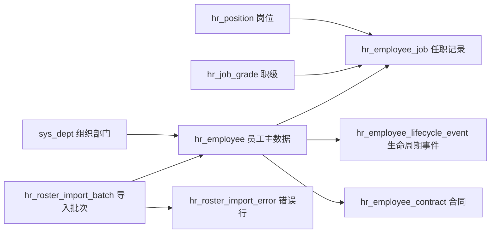

# HRMS 一期企业级设计方案

更新时间：2026-07-03
目标版本：v0.0.50 起
状态：Phase 1A 已在 v0.0.51 开始落地，Phase 1B 员工生命周期动作已在 v0.0.52 开始落地，Phase 1C 生命周期时间线已在 v0.0.54 落地，Phase 1D 合同核心接口已在 v0.0.55 开始落地，v0.0.56 已补齐合同终止和到期查询，v0.0.58 已开始落地花名册导入，v0.0.65 已补齐员工基础信息编辑闭环

## 1. 设计目标

HRMS 一期采用“主数据 + 合同 + 花名册”方案，先建立企业人力主数据底座，不在一期贸然进入考勤、薪酬、绩效等规则复杂域。

一期目标：

- 建立独立 `hr` 业务域，避免把人力业务继续塞进 `system` 模块。
- 建立员工、岗位、职级、任职、生命周期、合同、花名册导入导出的核心模型。
- 所有接口天然接入 ONES-ADMIN 现有企业级底座：Sa-Token 权限、统一响应、TraceId、操作审计、防重复提交、接口治理元数据、Flyway 迁移治理。
- 前端沿用当前 Vben / Ant Design Vue 后台风格：查询表单、数据表格、抽屉/弹窗表单、详情页、导入导出任务视图，不做独立 HR SaaS 风格。
- 对员工敏感字段预留数据脱敏和数据权限边界，避免后续返工。

## 2. 参考来源

本设计延续 `hrms-enterprise-research.md` 的调研，并在 2026-07-02 通过 agent-reach GitHub/dev 路由复核以下开源仓库公开状态。

| 项目 | 最新公开信息 | 一期借鉴点 |
| --- | --- | --- |
| [frappe/hrms](https://github.com/frappe/hrms) | Open Source HR and Payroll Software，8146 stars，2026-07-02 更新 | 员工生命周期、考勤/薪酬后置、员工档案作为 HRMS 中心资产 |
| [orangehrm/orangehrm](https://github.com/orangehrm/orangehrm) | 综合 HRM 系统，1081 stars，2026-06-30 更新 | Employee Management、Reporting、Recruitment、Onboarding、Leave 的分层边界 |
| [gamonoid/icehrm](https://github.com/gamonoid/icehrm) | 中小企业 HRMS，716 stars，2026-06-29 更新 | 先做员工信息与实用流程，再扩展假勤、薪酬、报表 |
| [CybroOdoo/OpenHRMS](https://github.com/CybroOdoo/OpenHRMS) | Odoo 生态 HRMS，169 stars，2026-06-29 更新 | 模块化 HR 能力、员工主数据与业务流程解耦 |

取舍结论：ONES-ADMIN 不复制这些项目的实现和许可证内容，只吸收模块边界、生命周期建模、主数据优先和企业管控思路。

## 3. 一期范围

一期纳入：

- 组织复用：复用现有 `sys_dept` 作为组织部门树。
- 岗位与职级：新增岗位、职级基础资料。
- 员工主数据：员工编号、姓名、联系方式、证件摘要、入职日期、用工状态、所属部门、岗位、职级、直属上级。
- 任职记录：记录部门、岗位、职级、上级、用工类型等任职变化。
- 生命周期事件：入职、转正、调岗、离职、再入职、状态变更。
- 合同管理：合同编号、合同类型、期限、试用期、续签提醒、附件引用边界。
- 花名册导入导出：模板下载、批量导入、错误行报告、导出筛选结果。

一期不纳入：

- 请假、考勤、排班、假期余额。
- 薪酬、个税、社保、公积金。
- 招聘、候选人、面试、Offer。
- 绩效、培训、员工自助移动端。
- 完整数据权限引擎。这里仅预留字段和接口扩展点。

## 4. 业务域模型



核心原则：

- `hr_employee` 存当前快照，方便列表查询和权限判断。
- `hr_employee_job` 存任职历史，避免调岗后丢失历史。
- `hr_employee_lifecycle_event` 存业务事件，支持审计和员工详情时间线。
- `hr_employee_contract` 独立管理合同，不把合同字段堆进员工表。
- 导入批次与错误行独立建模，导入失败可追踪、可下载、可重试。

## 5. 表结构草案

### 5.1 hr_position

| 字段 | 类型建议 | 说明 |
| --- | --- | --- |
| `id` | bigint | 主键 |
| `position_code` | varchar(64) | 岗位编码，唯一 |
| `position_name` | varchar(100) | 岗位名称 |
| `dept_id` | bigint | 默认所属部门，可为空 |
| `description` | varchar(500) | 岗位说明 |
| `enabled` | tinyint(1) | 是否启用 |
| `created_at` / `updated_at` | datetime | 创建/更新时间 |

索引建议：

- 唯一索引：`uk_hr_position_code(position_code)`。
- 普通索引：`idx_hr_position_dept(dept_id)`。

### 5.2 hr_job_grade

| 字段 | 类型建议 | 说明 |
| --- | --- | --- |
| `id` | bigint | 主键 |
| `grade_code` | varchar(64) | 职级编码，唯一 |
| `grade_name` | varchar(100) | 职级名称 |
| `grade_rank` | int | 职级排序，数值越大级别越高 |
| `enabled` | tinyint(1) | 是否启用 |
| `created_at` / `updated_at` | datetime | 创建/更新时间 |

索引建议：

- 唯一索引：`uk_hr_job_grade_code(grade_code)`。
- 普通索引：`idx_hr_job_grade_rank(grade_rank)`。

### 5.3 hr_employee

| 字段 | 类型建议 | 说明 |
| --- | --- | --- |
| `id` | bigint | 主键 |
| `employee_no` | varchar(64) | 员工编号，唯一 |
| `real_name` | varchar(100) | 员工姓名 |
| `preferred_name` | varchar(100) | 常用名，可为空 |
| `gender` | varchar(20) | 性别枚举 |
| `mobile` | varchar(32) | 手机号，敏感字段 |
| `email` | varchar(128) | 邮箱 |
| `id_card_masked` | varchar(64) | 证件号脱敏展示值 |
| `id_card_encrypted` | varchar(255) | 证件号加密值，后续接入加密组件 |
| `dept_id` | bigint | 当前部门，关联 `sys_dept` |
| `position_id` | bigint | 当前岗位 |
| `grade_id` | bigint | 当前职级 |
| `manager_employee_id` | bigint | 直属上级员工 ID |
| `employment_type` | varchar(32) | 全职、兼职、实习、外包等 |
| `employment_status` | varchar(32) | 在职、试用、离职、停用等 |
| `hire_date` | date | 入职日期 |
| `probation_end_date` | date | 试用期结束日期 |
| `leave_date` | date | 离职日期，可为空 |
| `remark` | varchar(500) | 备注 |
| `created_at` / `updated_at` | datetime | 创建/更新时间 |

索引建议：

- 唯一索引：`uk_hr_employee_no(employee_no)`。
- 普通索引：`idx_hr_employee_dept_status(dept_id, employment_status)`。
- 普通索引：`idx_hr_employee_position(position_id)`。
- 普通索引：`idx_hr_employee_manager(manager_employee_id)`。
- 普通索引：`idx_hr_employee_hire_date(hire_date)`。

### 5.4 hr_employee_job

| 字段 | 类型建议 | 说明 |
| --- | --- | --- |
| `id` | bigint | 主键 |
| `employee_id` | bigint | 员工 ID |
| `dept_id` | bigint | 部门 |
| `position_id` | bigint | 岗位 |
| `grade_id` | bigint | 职级 |
| `manager_employee_id` | bigint | 直属上级 |
| `employment_type` | varchar(32) | 用工类型 |
| `effective_date` | date | 生效日期 |
| `end_date` | date | 结束日期，可为空 |
| `change_reason` | varchar(255) | 变更原因 |
| `created_at` / `updated_at` | datetime | 创建/更新时间 |

索引建议：

- 普通索引：`idx_hr_employee_job_employee(employee_id, effective_date)`。
- 普通索引：`idx_hr_employee_job_dept(dept_id)`。

### 5.5 hr_employee_lifecycle_event

| 字段 | 类型建议 | 说明 |
| --- | --- | --- |
| `id` | bigint | 主键 |
| `employee_id` | bigint | 员工 ID |
| `event_type` | varchar(32) | 入职、转正、调岗、离职、再入职、状态变更 |
| `event_date` | date | 事件日期 |
| `before_status` | varchar(32) | 变更前状态 |
| `after_status` | varchar(32) | 变更后状态 |
| `summary` | varchar(255) | 事件摘要 |
| `detail_json` | json | 事件明细，记录关键字段变更 |
| `created_by` | bigint | 操作人 |
| `created_at` | datetime | 创建时间 |

索引建议：

- 普通索引：`idx_hr_lifecycle_employee(employee_id, event_date)`。
- 普通索引：`idx_hr_lifecycle_type(event_type)`。

### 5.6 hr_employee_contract

| 字段 | 类型建议 | 说明 |
| --- | --- | --- |
| `id` | bigint | 主键 |
| `employee_id` | bigint | 员工 ID |
| `contract_no` | varchar(64) | 合同编号，唯一 |
| `contract_type` | varchar(32) | 固定期限、无固定期限、实习、劳务等 |
| `status` | varchar(32) | 草稿、生效、即将到期、已终止 |
| `start_date` | date | 合同开始日期 |
| `end_date` | date | 合同结束日期，可为空 |
| `probation_months` | int | 试用期月数 |
| `renewal_remind_date` | date | 续签提醒日期 |
| `attachment_file_id` | bigint | 附件文件 ID，等文件元数据表落地后关联 |
| `remark` | varchar(500) | 备注 |
| `created_at` / `updated_at` | datetime | 创建/更新时间 |

索引建议：

- 唯一索引：`uk_hr_contract_no(contract_no)`。
- 普通索引：`idx_hr_contract_employee(employee_id)`。
- 普通索引：`idx_hr_contract_status_end_date(status, end_date)`。

### 5.7 hr_roster_import_batch

| 字段 | 类型建议 | 说明 |
| --- | --- | --- |
| `id` | bigint | 主键 |
| `batch_no` | varchar(64) | 导入批次号，唯一 |
| `file_name` | varchar(255) | 原始文件名 |
| `status` | varchar(32) | 解析中、校验失败、部分成功、成功、失败 |
| `total_count` | int | 总行数 |
| `success_count` | int | 成功行数 |
| `failed_count` | int | 失败行数 |
| `created_by` | bigint | 上传人 |
| `created_at` / `completed_at` | datetime | 创建/完成时间 |

索引建议：

- 唯一索引：`uk_hr_roster_import_batch_no(batch_no)`。
- 普通索引：`idx_hr_roster_import_created(created_by, created_at)`。

### 5.8 hr_roster_import_error

| 字段 | 类型建议 | 说明 |
| --- | --- | --- |
| `id` | bigint | 主键 |
| `batch_id` | bigint | 导入批次 ID |
| `row_number` | int | Excel 行号 |
| `employee_no` | varchar(64) | 行内员工编号 |
| `field_name` | varchar(64) | 错误字段 |
| `error_message` | varchar(500) | 错误说明 |
| `raw_json` | json | 原始行数据 |
| `created_at` | datetime | 创建时间 |

索引建议：

- 普通索引：`idx_hr_roster_error_batch(batch_id, row_number)`。

## 6. 枚举设计

| 枚举 | 值 |
| --- | --- |
| `EmploymentStatus` | `ACTIVE` 在职、`PROBATION` 试用、`SUSPENDED` 停用、`RESIGNED` 离职 |
| `EmploymentType` | `FULL_TIME` 全职、`PART_TIME` 兼职、`INTERN` 实习、`OUTSOURCED` 外包 |
| `LifecycleEventType` | `ONBOARD` 入职、`REGULARIZE` 转正、`TRANSFER` 调岗、`RESIGN` 离职、`REHIRE` 再入职、`STATUS_CHANGE` 状态变更 |
| `ContractType` | `FIXED_TERM` 固定期限、`OPEN_ENDED` 无固定期限、`INTERNSHIP` 实习、`SERVICE` 劳务 |
| `ContractStatus` | `DRAFT` 草稿、`ACTIVE` 生效、`EXPIRING` 即将到期、`TERMINATED` 已终止 |
| `ImportStatus` | `PARSING` 解析中、`VALIDATION_FAILED` 校验失败、`PARTIAL_SUCCESS` 部分成功、`SUCCESS` 成功、`FAILED` 失败 |

这些枚举一期可先在后端常量中维护，待数据字典模块落地后迁移到字典管理。

## 7. 后端包结构

建议结构：

```text
com.ones.admin.hr
├── HrErrorCode.java
├── employee
│   ├── EmployeeController.java
│   ├── EmployeeService.java
│   ├── dto
│   ├── entity
│   └── mapper
├── position
│   ├── PositionController.java
│   ├── PositionService.java
│   ├── dto
│   ├── entity
│   └── mapper
├── contract
│   ├── HrEmployeeContractController.java
│   ├── HrEmployeeContractService.java
│   ├── dto
│   ├── entity
│   └── mapper
├── lifecycle
│   ├── EmployeeLifecycleService.java
│   └── dto
└── roster
    ├── RosterImportController.java
    ├── RosterImportService.java
    └── dto
```

分层约束：

- Controller 只做请求参数、权限入口和统一响应。
- Service 承担事务边界、校验、生命周期事件写入和审计语义。
- Mapper 只做数据访问，不写业务判断。
- DTO / VO 和实体分离，不把数据库实体直接暴露给前端。
- HR 写接口必须使用 `@RepeatSubmit`。
- HR 接口必须补齐 `@Tag`、`@Operation(operationId=...)`、`@SaCheckPermission`、`@ApiResourceMetadata`。

## 8. API 设计草案

### 8.1 员工

| 方法 | 路径 | operationId | 权限码 | 说明 |
| --- | --- | --- | --- | --- |
| `GET` | `/api/hr/employees` | `EmployeeController_listEmployees` | `hr:employee:list` | 员工列表，支持分页、部门、状态、岗位、关键字筛选 |
| `GET` | `/api/hr/employees/{id}` | `EmployeeController_getEmployee` | `hr:employee:detail` | 员工详情，包含任职、合同摘要、生命周期时间线 |
| `POST` | `/api/hr/employees` | `EmployeeController_createEmployee` | `hr:employee:create` | 新增员工，写入主数据、首条任职记录和入职事件 |
| `PUT` | `/api/hr/employees/{id}` | `EmployeeController_updateEmployee` | `hr:employee:update` | 编辑员工基础信息，不直接处理调岗/离职 |
| `POST` | `/api/hr/employees/{id}/transfer` | `EmployeeController_transferEmployee` | `hr:employee:transfer` | 调岗，写入任职记录和生命周期事件 |
| `POST` | `/api/hr/employees/{id}/regularize` | `EmployeeController_regularizeEmployee` | `hr:employee:regularize` | 转正 |
| `POST` | `/api/hr/employees/{id}/resign` | `EmployeeController_resignEmployee` | `hr:employee:resign` | 离职 |
| `GET` | `/api/hr/employees/export` | `EmployeeController_exportEmployees` | `hr:employee:export` | 导出花名册 CSV/Excel |

### 8.2 岗位与职级

| 方法 | 路径 | operationId | 权限码 | 说明 |
| --- | --- | --- | --- | --- |
| `GET` | `/api/hr/positions` | `PositionController_listPositions` | `hr:position:list` | 岗位列表 |
| `POST` | `/api/hr/positions` | `PositionController_createPosition` | `hr:position:create` | 新增岗位 |
| `PUT` | `/api/hr/positions/{id}` | `PositionController_updatePosition` | `hr:position:update` | 编辑岗位 |
| `POST` | `/api/hr/positions/{id}/disable` | `PositionController_disablePosition` | `hr:position:update` | 禁用岗位 |
| `GET` | `/api/hr/job-grades` | `JobGradeController_listJobGrades` | `hr:job-grade:list` | 职级列表 |
| `POST` | `/api/hr/job-grades` | `JobGradeController_createJobGrade` | `hr:job-grade:create` | 新增职级 |
| `PUT` | `/api/hr/job-grades/{id}` | `JobGradeController_updateJobGrade` | `hr:job-grade:update` | 编辑职级 |

### 8.3 合同

| 方法 | 路径 | operationId | 权限码 | 说明 |
| --- | --- | --- | --- | --- |
| `GET` | `/api/hr/employees/{employeeId}/contracts` | `HrEmployeeContractController_listContracts` | `hr:contract:list` | 员工合同列表 |
| `POST` | `/api/hr/employees/{employeeId}/contracts` | `HrEmployeeContractController_createContract` | `hr:contract:create` | 新增合同 |
| `PUT` | `/api/hr/employees/{employeeId}/contracts/{contractId}` | `HrEmployeeContractController_updateContract` | `hr:contract:update` | 编辑合同 |
| `POST` | `/api/hr/contracts/{id}/terminate` | `HrEmployeeContractController_terminateContract` | `hr:contract:terminate` | 终止合同 |
| `GET` | `/api/hr/contracts/expiring` | `HrEmployeeContractController_listExpiringContracts` | `hr:contract:list` | 即将到期合同 |

### 8.4 花名册导入

| 方法 | 路径 | operationId | 权限码 | 说明 |
| --- | --- | --- | --- | --- |
| `GET` | `/api/hr/roster-import/template` | `RosterImportController_downloadTemplate` | `hr:roster:import` | 下载导入模板 |
| `POST` | `/api/hr/roster-import/batches` | `RosterImportController_importRoster` | `hr:roster:import` | 上传并导入花名册 |
| `GET` | `/api/hr/roster-import/batches` | `RosterImportController_listBatches` | `hr:roster:list` | 导入批次列表 |
| `GET` | `/api/hr/roster-import/batches/{id}` | `RosterImportController_getBatch` | `hr:roster:list` | 导入批次详情 |
| `GET` | `/api/hr/roster-import/batches/{id}/errors` | `RosterImportController_listErrors` | `hr:roster:list` | 错误行列表 |

接口治理要求：

- 所有写接口风险级别至少 `HIGH`，并接入 `@RepeatSubmit`。
- 员工详情、合同详情属于敏感数据，`riskLevel` 至少 `MEDIUM`。
- 花名册导入接口必须限制文件类型、文件大小和行数。
- 导出接口必须防 CSV/Excel 公式注入，复用现有 `CsvExportUtils` 或后续 Excel 导出工具的等价防护。

## 9. 权限与菜单

菜单建议：

```text
HRMS
├── 员工档案
├── 岗位职级
├── 合同管理
└── 花名册导入
```

权限码建议：

| 权限码 | 用途 |
| --- | --- |
| `hr:employee:list` | 查询员工 |
| `hr:employee:detail` | 查看员工详情 |
| `hr:employee:create` | 新增员工 |
| `hr:employee:update` | 编辑员工 |
| `hr:employee:transfer` | 调岗 |
| `hr:employee:regularize` | 转正 |
| `hr:employee:resign` | 离职 |
| `hr:employee:export` | 导出员工花名册 |
| `hr:position:list` | 查询岗位 |
| `hr:position:create` | 新增岗位 |
| `hr:position:update` | 编辑/禁用岗位 |
| `hr:job-grade:list` | 查询职级 |
| `hr:job-grade:create` | 新增职级 |
| `hr:job-grade:update` | 编辑职级 |
| `hr:contract:list` | 查询合同 |
| `hr:contract:create` | 新增合同 |
| `hr:contract:update` | 编辑合同 |
| `hr:contract:terminate` | 终止合同 |
| `hr:roster:list` | 查询导入批次 |
| `hr:roster:import` | 导入花名册 |

一期初始化策略：

- Flyway 新增权限数据时，需要同时写入 `sys_permission` 与菜单按钮授权树。
- 超级管理员默认拥有 HRMS 全部权限。
- 普通 HR 角色建议默认只配置员工、岗位、合同、导入相关权限，不授予系统管理权限。

## 10. 事务与一致性

关键事务：

- 新增员工：写 `hr_employee`、`hr_employee_job`、`hr_employee_lifecycle_event` 必须同事务。
- 调岗：更新 `hr_employee` 当前快照、关闭旧 `hr_employee_job.end_date`、新增任职记录、写生命周期事件必须同事务。
- 离职：更新员工状态和离职日期、关闭任职记录、终止或保留合同状态、写生命周期事件必须同事务。
- 合同终止：更新合同状态，必要时写生命周期事件或操作日志。
- 花名册导入：按批次事务分段处理，不能一个大事务包住全部 Excel 行；建议每批 100 到 500 行提交一次，失败行写错误表。

并发控制：

- 员工编号、合同编号、岗位编码、职级编码必须靠唯一约束兜底。
- 员工调岗/离职可在后续加入乐观锁字段 `version`，一期若不加，也必须在 Service 层用当前状态校验避免重复离职。
- 导入必须支持幂等校验：同批次号不可重复执行；同员工编号按导入模式决定新增、更新或拒绝。

## 11. 敏感数据与审计

敏感字段：

- 手机号、证件号、邮箱、合同附件。
- 一期响应默认返回脱敏证件号，不返回完整证件号。
- 手机号在列表页可脱敏展示，详情页是否完整展示由后续数据权限决定。

审计要求：

- HRMS 所有写接口纳入操作审计。
- 员工新增、调岗、转正、离职、合同新增、合同终止、导入花名册必须能通过 TraceId 追踪。
- 生命周期事件是业务审计，不替代操作日志；两者都需要保留。
- 导入错误报告不应输出完整证件号。

## 12. 前端页面设计

前端必须保持当前 Vben 选型风格，不做独立设计体系。

页面建议：

| 页面 | 路由 | 主要组件形态 |
| --- | --- | --- |
| 员工档案 | `/hr/employees` | 查询表单 + VxeGrid 表格 + 新增/编辑抽屉 + 状态标签 |
| 员工详情 | `/hr/employees/:id` | 基础信息描述区 + 任职记录表 + 合同表 + 生命周期时间线 |
| 岗位职级 | `/hr/positions` | 左右或 Tabs 结构，岗位表与职级表并列管理 |
| 合同管理 | `/hr/contracts` | 查询表单 + 合同表 + 即将到期筛选 |
| 花名册导入 | `/hr/roster-import` | 上传组件 + 批次表 + 错误行抽屉 |

交互要求：

- 删除、离职、合同终止必须二次确认。
- 调岗、转正、离职使用业务动作按钮，不在普通编辑表单中修改关键状态。
- 花名册导入先展示校验结果，再确认写入；失败行可下载。
- 表格必须具备加载、空数据、错误状态。
- 所有接口错误展示后端 `traceId`。

## 13. Flyway 迁移计划

待确认后新增迁移：

- `V3__create_hrms_phase_one.sql`

迁移内容：

- 创建 `hr_position`、`hr_job_grade`、`hr_employee`、`hr_employee_job`、`hr_employee_lifecycle_event`、`hr_employee_contract`、`hr_roster_import_batch`、`hr_roster_import_error`。
- 写入 HRMS 菜单和权限点。
- 为超级管理员角色授权。

回滚策略：

- 一期属于新增表和新增权限，不改已有 `sys_` 表结构，回滚可通过停用菜单权限和保留空表完成。
- 如果必须物理回滚，需在人工审批后删除 `hr_` 表与相关菜单权限数据；破坏性 SQL 必须遵循现有数据库迁移治理标记。

## 14. 测试策略

后端测试：

- 员工新增成功，校验主表、任职记录、生命周期事件同时写入。
- 员工编号重复返回明确错误码。
- 调岗后当前快照更新，历史任职记录保留。
- 离职后员工状态、离职日期、任职结束日期一致。
- 合同编号唯一，合同到期查询准确。
- 花名册导入成功、部分成功、校验失败、错误行查询。
- 未授权用户访问 HRMS 接口返回 403。
- 接口治理报告中 HRMS 接口无 ERROR 级违规。

前端测试：

- 登录后可从菜单进入员工档案。
- 员工列表筛选、分页、空状态可用。
- 新增/编辑员工表单校验生效。
- 调岗/离职二次确认可见。
- 花名册导入错误行可查看。

## 15. 分期计划

| 阶段 | 目标 | 交付 |
| --- | --- | --- |
| Phase 1A | 后端基础模型 | Flyway 表、实体、Mapper、Service、员工/岗位/职级基础接口 |
| Phase 1B | 生命周期动作 | 调岗、转正、离职、业务事件 |
| Phase 1C | 生命周期时间线 | 员工详情页可消费的生命周期查询接口 |
| Phase 1D | 合同管理核心接口 | 员工合同列表、新增、编辑 |
| Phase 1E | 花名册导入导出 | 模板、导入批次、错误行、导出 |
| Phase 1F | 前端页面 | Vben 风格员工档案、详情、岗位职级、合同、导入页面 |
| Phase 1G | 治理闭环 | 接口治理、审计、E2E、Jenkins 报告 |

当前进展：

- `v0.0.51` 已完成 Phase 1A 的表结构迁移、岗位接口、职级接口、员工列表/详情/新增接口。
- `v0.0.52` 已完成 Phase 1B 的员工调岗、转正、离职接口。
- `v0.0.54` 已完成员工生命周期时间线查询接口，前端员工详情页可直接展示入职、调岗、转正、离职过程。
- `v0.0.55` 已完成员工合同列表、新增、编辑核心接口，补齐 `hr:contract:list/create/update` 权限闭环。
- `v0.0.56` 已完成合同终止和即将到期合同查询接口，补齐 `hr:contract:terminate` 权限闭环。
- `v0.0.58` 已完成花名册 CSV 模板下载、上传导入、导入批次列表/详情和错误行查询接口，补齐 `hr:roster:list/import` 权限闭环；导入成功行复用员工新增链路，失败行写入错误行表。
- `v0.0.61` 已将 HRMS 写接口纳入统一操作审计，员工、岗位、职级、合同和花名册导入等写操作可以通过 TraceId 在 `sys_operation_log` 中追踪。
- `v0.0.65` 已完成员工基础信息编辑接口和 Vben 员工编辑抽屉，补齐 `hr:employee:update` 权限闭环；基础编辑不处理部门、岗位、职级、状态和入离职日期，相关变更必须走调岗、转正、离职等生命周期接口。
- `v0.0.62` 已将写接口操作审计覆盖纳入接口资源清单、CSV、Manifest 和发布门禁，非公开写接口缺少审计覆盖会阻断发布。
- 员工新增、调岗、转正、离职已写入生命周期事件；调岗会维护任职历史。
- 合同附件文件元数据、花名册导出和 Vben 风格 HRMS 前端页面仍按后续阶段推进。

## 16. 待确认问题

进入实现前需要确认：

- 员工编号是否由系统自动生成，还是 HR 手工录入。
- 是否需要多公司主体；如果需要，`hr_employee` 和合同表要增加 `company_id`。
- 证件号一期是否只保存脱敏值，还是需要加密保存完整值。
- 花名册导入一期使用 CSV 还是 Excel；如果使用 Excel，需要确认依赖和模板格式。
- 合同附件一期是否只记录文件 ID，等待文件元数据表落地后再做完整附件管理。
- 是否需要把现有 `sys_user` 与员工关联；建议预留 `user_id` 字段，但一期不强制每个员工都有登录账号。
